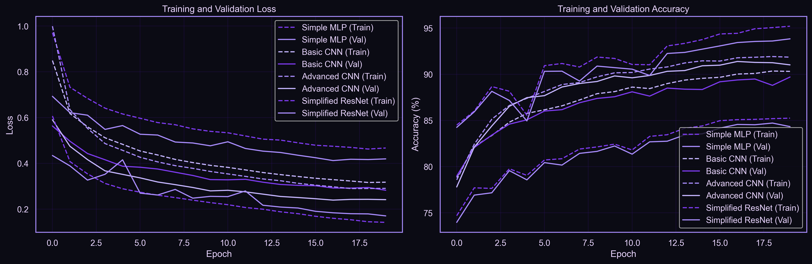

# 🟣 FashionMNIST Multi-Model Classifier

A deep learning benchmarking project comparing **MLP, CNN, Advanced CNN, and ResNet** architectures on the FashionMNIST dataset using PyTorch.  
Includes data augmentation, learning rate scheduling, and full evaluation pipeline with per-class analysis.



<div align="center">

━━━━━━━━━━━━━━ ✦ ✧ ✦ ━━━━━━━━━━━━━━

</div>

## 🟣 Overview

This project implements a complete image classification pipeline using multiple neural network architectures to benchmark performance on FashionMNIST.

It achieves **93%+ test accuracy** through:
- architecture comparison
- structured training pipeline
- regularization + augmentation
- learning rate scheduling

<br><br>

## 🟣 Results

| Model | Test Accuracy | F1-Score | Parameters |
|------|---------------|----------|------------|
| **Simplified ResNet** | **93.2%** | **93.1%** | ~250K |
| Advanced CNN | 92.8% | 92.7% | ~450K |
| Basic CNN | 90.5% | 90.3% | ~200K |
| Simple MLP | 87.1% | 86.9% | ~650K |

<br><br>

## 🟣 Key Features

- Data Augmentation (flip, rotation, affine transforms)
- Batch Normalization for stable training
- Dropout regularization (0.3–0.5)
- L2 weight decay (1e-4)
- Learning rate warmup + cosine annealing
- Residual learning (ResNet-style skip connections)
- Full evaluation pipeline (accuracy, F1-score, confusion matrix)

<br><br>

## 🟣 Model Architectures

1. **Simple MLP** — Fully connected baseline model  
2. **Basic CNN** — 2 convolution layers + FC classifier  
3. **Advanced CNN** — deeper CNN with BN + dropout  
4. **Simplified ResNet** — residual blocks with skip connections  

<br><br>

## 🟣 Technologies Used

- Python 3.9+
- PyTorch
- torchvision
- NumPy, Pandas
- Matplotlib, Seaborn
- scikit-learn
- Jupyter Notebook

<br><br>

## 🟣 Project Structure

fashion-mnist-classifier/
├── notebooks/
│   └── fashion_mnist_experiments.ipynb
├── models/
│   ├── model_architectures.py
│   └── *.pth
├── utils/
│   └── helpers.py
├── results/
│   ├── all_models_training_history.png
│   ├── confusion_matrix.png
│   ├── per_class_f1_scores.png
│   ├── sample_predictions.png
│   └── model_comparison.csv
└── README.md

<br><br>

## 🟣 Performance Analysis

### Best Model: Simplified ResNet

- Strongest generalization performance
- Most balanced precision/recall tradeoff
- Best per-class consistency

### Key Observations

- Shirt vs T-shirt/top → highest confusion
- Pullover vs Coat → overlapping features
- Trouser / Bag / Ankle boot → easiest classes

<br><br>

## 🟣 Training Configuration

```python
{
  'batch_size': 128,
  'num_epochs': 20,
  'learning_rate': 0.001,
  'weight_decay': 1e-4,
  'optimizer': 'Adam',
  'augmentation': True
}
````

<br><br>

## 🟣 Learning Rate Strategy

* Warmup phase: first 3 epochs
* Cosine annealing decay afterward
* Adaptive stabilization across models

<br><br>

## 🟣 Generated Outputs

* Training history plots
* Confusion matrices
* Per-class F1 analysis
* Sample prediction visualizations
* Model comparison CSV
* Saved PyTorch checkpoints

<br><br>

## 🟣 Future Improvements

* Ensemble learning (voting / averaging)
* EfficientNet / Vision Transformer models
* Mixup / CutMix augmentation
* K-fold cross validation
* TensorBoard logging
* Deployment via FastAPI / Flask

<br><br>
